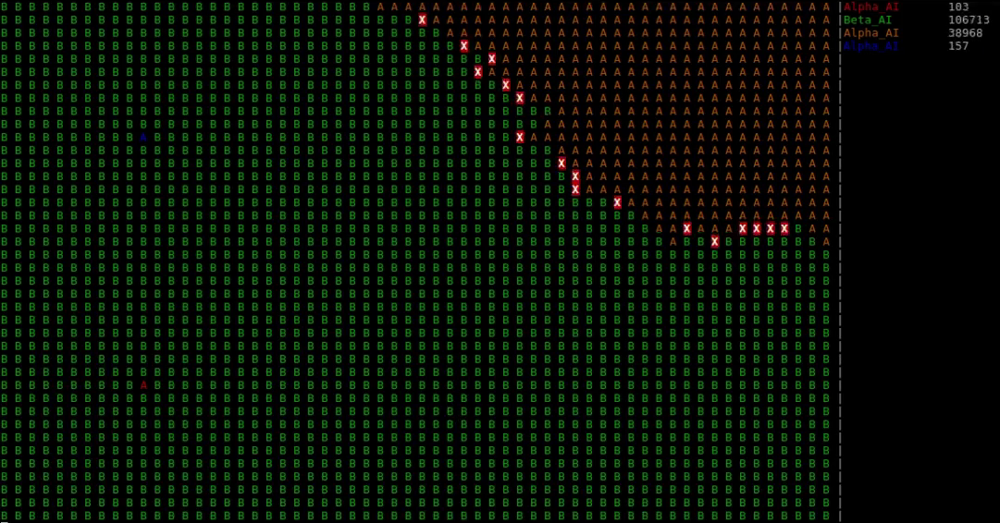

ASCII Empire
===
It is command line based zero-player game, The "empire" are been controls by program, so what human do is writing AI with definition which defined by header in the `include` . 

This side project was written when I was senior (industrial) vocational high school student in 2015, and been rewrite in 2017, there not been refactoring up to now, so the code been a bit of messing up and not document.

I added cmake support in 2020.



### Compile and Run
```shell
git clone https://github.com/FlySkyPie/ascii-empire.git
cd ascii-empire
mkdir build
cd build
cmake ..
make
cd ../bin
./simulator
```

### Simulator Usage
Type command in to operate menu:
- `next` : Move selected arrow front.
- `back`: Move selected arrow back.
- `enter`: Use current selection.

### Video Demo
[](https://youtu.be/-BwoOr0KsqE "C++ AI fight program 2.0")